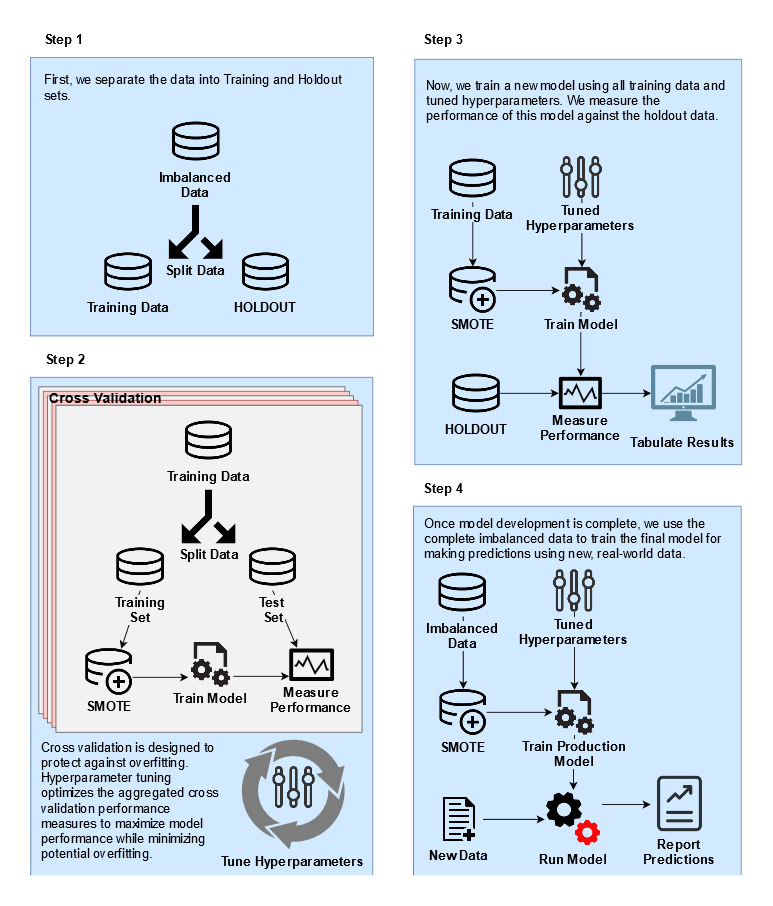

`r format(Sys.time(), '%d %B %Y')`

## Outline

- [Introduction]
- [Data] 
- [Model Development] 
    - [Model Setup]
    - [Tune Hyperparameters]
    - [Measuring Performance] 
- [Results]
- [Interpretability]
- [Production Model]


## Introduction

### Background

This notebook presents a reference implementation of an imbalanced data problem, namely predicting employee attrition. We'll use [`mlr`](https://mlr-org.github.io/mlr/index.html), a package designed to provide an infrastructure for Machine Learning in R. Additionally, there is a [companion notebook](VanillaVsSMOTE.md) that investigates the effectiveness of SMOTE compared to non-SMOTE models. 

Unfortunately, the data is proprietary and we cannot disclose the details of the data with outside parties. But the field represented by this data sees 20% annual turnover in employees. Each employee separation costs roughly \$20K. Meaning, a 25% reduction to employee attrition results in an annual savings of over \$400K.  

Using a predictive model, HR organizations can build on the data of today to anticipate the events of tomorrow. This forward notice offers the opportunity to respond by developing a tailored retention strategy to retain employees before they jump ship.  

This work was part of a one month PoC for an Employee Attrition Analytics project at Honeywell International. I presented this notebook at a Honeywell internal data science meetup group and received permission to post it publicly. I would like to thank Matt Pettis (Managing Data Scientist), Nabil Ahmed (Solution Architect), Kartik Raval (Data SME), and Jason Fraklin (Business SME). Without their mentorship and contributions, this project would not have been possible.

### Setup

```{r setup,  message=FALSE, warning=FALSE}
# Libraries
library(tidyverse)    # Data manipulation
library(mlr)          # Modeling framework
library(parallelMap)  # Parallelization 
library(rpart.plot)   # Decision Tree Visualization
library(parallel)     # To detect # of cores

# Parallelization
parallelStartSocket(detectCores())

# Loading Data
source("prep_EmployeeAttrition.R")
```

### Data

Since the primary purpose of this notebook is modeling employee attrition, we won't go into the data preprocessing steps; but they involved sql querying, reformatting, cleaning, filtering, and variable creation. 

The loaded data represents a snapshot in time, aggregating 52-weeks of history into performance and summary metrics. To build a predictive model, we choose the end of this 52-week period to be at least 4 weeks in the past. Finally we created a variable indicating if an employee left in the following four week period. 

To get summary statistics within `mlr`, you can use `summarizeColumns()`:  
```{r eval=FALSE}
summarizeColumns(data)
```
_Output not shown for proprietary reasons._

#### Data Structure

Employees: `r dim(data)[1]`   <br>
Model Features: `r dim(data %>% select(-c(!! exclude)))[2] - 1`   <br>
Target Variable: _Left4wk_    <br>

```{r, comment=NA}
data %>% 
  summarise(`Total Employees` = n(),
            `Attrition Count` = sum(Left4wk=="Left"),
            `Attrition Percent` = mean(Left4wk=="Left")) %>% knitr::kable()
```

#### Considerations
**Concern:** Employee attrition is a imbalanced classification problem, meaning that the group of interest is relatively rare. This can cause models to overclassify the majority group in an effort to get better accuracy. After all, if predict every employee will stay, we can get an accuracy of `r round((1 - mean(data$Left4wk=="Left"))*100, 1)`%, but this is not a useful model.   
**Solution:** There are two general methods to overcome this issue: sampling techniques and skew-insensitive classifiers. Synthetic Minority Oversampling TEchnique (SMOTE) is a sampling technique well suited for employee attrition. We'll use this method to create a balanced model for predicting employee attrition.


## Model Development

We'll use `mlr` to help us setup the models, run cross-validation, perform hyperparameter tuning, and measure performance of the final models. 

### Model Setup

#### Defining the Task

Just as `dplyr` provides a grammar for manipulating data frames, `mlr` provides a grammar for data modeling. The first grammatical object is the _task_. A _task_ is an object that defines at minimum the data and the target. 

For this project, our task is to predict employee attrition 4 weeks out. Here we also create a holdout test and train dataset for each task.  
```{r warning=FALSE, cache=TRUE}
# Defining Task
tsk_4wk <- makeClassifTask(id = "4 week prediction", 
                       data = data %>% select(-c(!! exclude)), 
                       target = "Left4wk",  # Must be a factor variable
                       positive = "Left"
                       )
tsk_4wk <- mergeSmallFactorLevels(tsk_4wk)

# Creating 4 week holdout datasets
ho_4wk <- makeResampleInstance("Holdout", tsk_4wk, stratify = TRUE)   # Default 1/3rd 
tsk_train_4wk <- subsetTask(tsk_4wk, ho_4wk$train.inds[[1]])
tsk_test_4wk <- subsetTask(tsk_4wk, ho_4wk$test.inds[[1]])
```

Note that the target variable needs to be a factor variable. For Python users, a factor variable is a data type within R specific for representing categorical variables. It can represent information as ordered (e.g. small, medium, large) or unordered (e.g. red, green, blue) and models can take advantage of these relationships. Variables in this dataset were reformatted to factor as part of the preprocessing.  

```{r warning=FALSE, comment=NA}
train_target <- table(getTaskTargets(tsk_train_4wk))
train_target
```
Again, we are dealing with an imbalanced classification problem. After splitting the data, our training sample has `r train_target["Left"]` employees that left out of `r sum(train_target)` total employees. 

We'll use the SMOTE technique described earlier to synthetically generate more employees that left. This will result in a more balanced dataset for training. However, since the test set is still imbalanced, we need to consider balanced performance measures like balanced accuracy and F1 when evaluating and tuning our models. 

#### Defining the Learners
 
Next, we'll use three different models to predict employee attrition. The advantage of this approach is that some models perform better on certain problems. By using a few different models were more likely to use a good model for this problem. Also, while some models might provide a better answer, they can be more difficult to explain how or why they work. By using multiple models, we should be able to provide both a predictive and explainable answer. The best of both worlds.

Here we define the three models we will use to predict employee attrition. Notice they are wrapped in a SMOTE function. 
```{r}
lrns <- list(
  makeSMOTEWrapper(makeLearner("classif.logreg", predict.type = "prob"), 
                   sw.rate = 18, sw.nn = 8),
  makeSMOTEWrapper(makeLearner("classif.rpart", predict.type = "prob"), 
                   sw.rate = 18, sw.nn = 8),
  makeSMOTEWrapper(makeLearner("classif.randomForest", predict.type = "prob"), 
                   sw.rate = 18, sw.nn = 8))
```

#### Pause: Let's review the process flow


The order of operations is important. If you SMOTE before splitting the data, then you've effectively polluted the training set with information from the test set! `mlr` has a `smote()` function, but that works by redefining the task and will happen before the resampling split. Therefore, we wrapped the smote around the learner which is applied after the resampling split. 

#### Defining the Resampling Strategy

To ensure extensible models to new data, we'll use cross-validation to guard against overfitting.  
```{r}
folds <- 20
rdesc <- makeResampleDesc("CV", iters = folds, stratify = TRUE) # stratification with respect to the target
```

We use `r folds` folds here, but I'd recommend fewer during the exploratory phase since more folds require more computation. 

#### Model Cross-validation

Let's run a quick cross-validation iteration to see how the models perform before tuning them.
```{r, warning=FALSE, message=FALSE, cache=TRUE}
bchmk <- benchmark(lrns, 
                  tsk_train_4wk, 
                  rdesc, show.info = FALSE, 
                  measures = list(acc, bac, auc, f1))
bchmk_perf <- getBMRAggrPerformances(bchmk, as.df = TRUE)
bchmk_perf %>% select(-task.id) %>% knitr::kable()
```

Not bad; the best model has an accuracy of `r round(bchmk_perf[3,"acc.test.mean"]*100, 1)`%. By looking at different, sometimes competing, measures we can better gauge the performance of the models. Above we've computed accuracy, balanced accuracy, AUC, and F1.    

Shown below are boxplots showing the performance measure distribution for each of the `r folds` cross-validation iterations. All the models seem to perform reasonably well when applied to new data.  

```{r}
plotBMRBoxplots(bchmk, measure = acc)
```

However when we look at balanced accuracy, we see a performance drop. Balanced accuracy gives equal weight to the relative proportion of each class (left vs stayed) resulting in a more difficult metric.   

```{r}
plotBMRBoxplots(bchmk, measure = bac)
```

With this we've built some models, but now we need to refine them. Let's see if we can improve performance by tuning the hyperparameters.

### Tune Hyperparameters

Tuning works by optimizing the cross-validated aggregated performance metric like accuracy or balanced accuracy. This mitigates overfitting because each fold needs to perform reasonable well as to not pull down the aggregation. For this imbalanced data problem, we'll tune using both F1 score and balanced accuracy.

The SMOTE algorithm is defined by the parameters _rate_ and _nearest neighbors_. _Rate_ defines how much to oversample the minority class. _Nearest neighbors_ defines how many nearest neighbors to consider. For more information about this algorithm check out [this post](https://limnu.com/smote-visualization-for-data-science/) and the [original paper](https://arxiv.org/abs/1106.1813). Since SMOTE has tunable hyperparameters, we'll tune the logistic regression too. In addition, decision trees and randomForests have model specific hyperparameters. If you're unsure what hyperparameters are tunable, us `getParamSet(<learner>)` to find out. 

```{r}
# Logistic
logreg_ps <- makeParamSet(
              makeIntegerParam("sw.rate", lower = 8L, upper = 28L)
              ,makeIntegerParam("sw.nn", lower = 2L, upper = 8L)
              )
# DecisionTree
rpart_ps <- makeParamSet(
              makeIntegerParam("sw.rate", lower = 8L, upper = 28L)
              ,makeIntegerParam("sw.nn", lower = 2L, upper = 8L)
              ,makeIntegerParam("minsplit",lower = 10L, upper = 50L)
              ,makeIntegerParam("minbucket", lower = 5L, upper = 70L)
              ,makeNumericParam("cp", lower = 0.005, upper = .05)
              )
# RandomForest
randomForest_ps <- makeParamSet(
              makeIntegerParam("sw.rate", lower = 8L, upper = 28L)
              ,makeIntegerParam("sw.nn", lower = 2L, upper = 8L)
              ,makeIntegerParam("ntree", lower = 50L, upper = 600L)
              ,makeIntegerParam("mtry", lower = 1L, upper = 20L)
              ,makeIntegerParam("nodesize", lower = 4L, upper = 50L)
              )
```

After defining the bounds of each hyperparameter, we define the tuning control to intelligently  search the space for an optimal hyperparameter set. [Irace](http://iridia.ulb.ac.be/irace/) and [MBO](http://mlr-org.github.io/mlrMBO/) are different methods for optimizing hyperparameters. 
After tuning each model, we update the learner with the optimal configuration for future training. 

```{r tuning, cache=TRUE, warning=FALSE, message=FALSE}
# ctrl = makeTuneControlMBO(budget=200)
ctrl <- makeTuneControlIrace(maxExperiments = 400L)
logreg_tr <- tuneParams(lrns[[1]], tsk_train_4wk, rdesc, list(f1), logreg_ps, ctrl)
lrns[[1]] <- setHyperPars(lrns[[1]], par.vals=logreg_tr$x)

rpart_tr <- tuneParams(lrns[[2]], tsk_train_4wk, rdesc, list(f1), rpart_ps, ctrl)
lrns[[2]] <- setHyperPars(lrns[[2]], par.vals=rpart_tr$x)

randomForest_tr <- tuneParams(lrns[[3]], tsk_train_4wk, rdesc, list(f1), randomForest_ps, ctrl)
lrns[[3]] <- setHyperPars(lrns[[3]], par.vals=randomForest_tr$x)
```

It's important to know that for each iteration of the tuning process, a full cross-validation resampling of `r folds` folds occurs. 

### Measuring Performance

Now that we've tuned our hyperparameters, we need to train on all training data and assess model performance against the holdout. This will give us some idea how the model will perform on new data. 

```{r, warning=FALSE, message=FALSE, cache=TRUE}
bchmk <- benchmark(lrns, 
                  tsk_4wk, 
                  ho_4wk, show.info = FALSE, 
                  measures = list(acc, bac, auc, f1))
bchmk_perf <- getBMRAggrPerformances(bchmk, as.df = TRUE)
bchmk_perf %>% select(-task.id) %>% knitr::kable()
```

One advantage of using `mlr`'s `benchmark()` function is that we can create easy comparisons between the three models. Here is the traditional Area Under the Curve (ROC) visualizing one measure of classification performance. The model performs better as the curve stretches towards the upper left thereby maximizing the area. 

```{r cache=TRUE}
df_4wk <- generateThreshVsPerfData(bchmk, 
            measures = list(fpr, tpr, mmce, ppv, tnr, fnr), 
            task.id = '4 week prediction')
plotROCCurves(df_4wk) + ggtitle("Four week attrition model ROC curves")
```


Right now, we are testing the model against the holdout. But after we finish modeling, we'll train a model using all the data. To understand how well the model integrates new data, we'll create the learning curve for various measures of performance.

```{r warning=FALSE, message=FALSE, cache=TRUE}
rs_cv5 <- makeResampleDesc("CV", iters = 5, stratify = TRUE)
lc_4wk <- generateLearningCurveData(learners = lrns, 
                               task = tsk_4wk,
                               percs = seq(0.2, 1, by = 0.2), 
                               measures = list(acc, bac, auc, f1),
                               resampling = rs_cv5, 
                               stratify = TRUE,
                               show.info = FALSE)
```


```{r}
plotLearningCurve(lc_4wk, facet.wrap.ncol = 2) + 
  ggtitle("Four week prediction learning curve")
```


These plots show that the model may benefit from additional data but with decreasing marginal gains. If we want better performance, more data will only help so much--we'll need better features.  

## Results
### Confusion Matrices
#### Logistic

```{r echo=FALSE, warning=FALSE, comment=NA, cache=TRUE}
mdl_4wk_logistic <- train(lrns[[1]], tsk_train_4wk)
prd_4wk_logistic <- predict(mdl_4wk_logistic, tsk_test_4wk)
print(calculateConfusionMatrix(prd_4wk_logistic))
```
```{r echo=FALSE, comment=NA}
performance(prd_4wk_logistic, measures = list(acc, bac, f1))
```

#### Decision Tree

```{r echo=FALSE, warning=FALSE, comment=NA, cache=TRUE}
mdl_4wk_decisionTree <- train(lrns[[2]], tsk_train_4wk)
prd_4wk_decisionTree <- predict(mdl_4wk_decisionTree, tsk_test_4wk)
print(calculateConfusionMatrix(prd_4wk_decisionTree)) 
```
```{r echo=FALSE, comment=NA}
performance(prd_4wk_decisionTree, measures = list(acc, bac, f1))
```

#### randomForest

```{r echo=FALSE, warning=FALSE, comment=NA, cache=TRUE}
mdl_4wk_randomForest <- train(lrns[[3]], tsk_train_4wk)
prd_4wk_randomForest <- predict(mdl_4wk_randomForest, tsk_test_4wk)
print(calculateConfusionMatrix(prd_4wk_randomForest)) 
```
```{r echo=FALSE, comment=NA}
performance(prd_4wk_randomForest, measures = list(acc, bac, f1))
```

These results were computed by running each model on the holdout dataset to simulate new data. Therefore, we should expect similar outcomes from a live implemented production model. Since the randomForest performed the best, we'll use this model to train our production model but we could also create an ensemble using all three.

## Interpretability  

There are many ways to extract information from the results of a predictive model which could be valuable to the business. One simple way is to simply use the coefficients from the logistic regression to show any linear trends. 

```{r, eval=FALSE}
summary(getLearnerModel(mdl_4wk_logistic, more.unwrap = TRUE))
```

_Output not shown for proprietary reasons._

We can also use a decision tree to visualize how the model works and potential reasons why people leave.

```{r, eval=FALSE}
rpart.plot(getLearnerModel(mdl_4wk_decisionTree, more.unwrap=TRUE),
                       extra=104, 
                       box.palette="RdGy",
                       branch.lty=3, 
                       shadow.col="gray")
```

_Output not shown for proprietary reasons._

Feature importance plots can also provide valuable insight into how models work. The following code uses a method called permutation feature importance which measures the impact of randomly shuffling the values of a feature. 

```{r feature_importance, eval=FALSE, message=FALSE, warning=FALSE, cache=TRUE}

impt_4wk <- generateFilterValuesData(tsk_4wk,
                                     method = "permutation.importance",
                                     imp.learner = lrns[[3]], measure = mmce)

plotFilterValues(impt_4wk) + ggtitle("Feature Importance: 4 Week Prediction")
```

_Output not shown for proprietary reasons._

Many other methods exist to gain interpretability from blackbox models. A few such methods are [SHAP](https://arxiv.org/abs/1705.07874) and [LIME](https://arxiv.org/abs/1602.04938). Additionally, we can feed the results of these models into a clustering algorithm to group similar types of attrition. If distinct groups emerge, we can create profiles and describe what defines each group. 


## Production Model
Finally, we train on all the data to get a model to use on real world data. 

```{r, warning=FALSE, cache=TRUE}
mdl_4wk_final <- train(lrns[[3]], tsk_4wk)
```

If we were to deploy this model, we'd continue by setting up a model monitoring framework. Part of this consists of tests to alert on changes to: 

- Data
    - Continues to flow properly (both input and output)
    - Inputs are statistically similar to training data
- Model
    - Performance
    - Computational load (i.e. is the model taking too long to run for the service?)
    
For a more detailed list of tests for machine learning production systems, check out the paper by Google researchers, "[What’s your ML Test Score? A rubric for ML production systems](https://www.eecs.tufts.edu/~dsculley/papers/ml_test_score.pdf)".

```{r comment=NA}
parallelStop()
```

