Vanilla vs SMOTE Flavored Imbalanced Classification
================
By Patrick D Mobley

15 May 2018

Outline
-------

-   [Introduction](#introduction)
-   [Setup](#setup)
-   [Benchmarking Logistic Regression](#benchmarking-logistic-regression)
-   [Benchmarking Decision Tree](#benchmarking-decision-tree)
-   [Benchmarking randomForest](#benchmarking-randomforest)
-   [Conclusion](#conclusion)

Introduction
------------

This is a companion notebook to [*Imbalanced Classification with mlr*](Imbalanced_Classification_with_mlr.md). In this notebook, we investigate whether SMOTE actually improves model performance. For clarity, non-SMOTE models are referred to as *"vanilla"* models. We compare these two flavors (vanilla and SMOTE) using **logistic regression**, **decision trees**, and **randomForest**. We also consider how tuning model operating thresholds and tuning SMOTE parameters impact the results.

If you must know, I *had* to make this. We kept debating on the effectiveness of techniques like SMOTE during my lunch break. Eventually, my curiosity won out and here we are. Does SMOTE work? Keep reading to find out! Or just skip to the conclusion.

For more information about this algorithm, check out the [original paper](https://arxiv.org/abs/1106.1813). Or if you're looking for a visual explanation, [this post](https://limnu.com/smote-visualization-for-data-science/) does a good job.

The findings in this notebook represent observed trends but actual results may vary. Additionally, different datasets may respond differently to SMOTE. These findings are not verified by the FDA. ;)

This work was part of a one month PoC for an Employee Attrition Analytics project at Honeywell International. I presented this notebook at a Honeywell internal data science meetup group and received permission to post it publicly. I would like to thank Matt Pettis (Managing Data Scientist), Nabil Ahmed (Solution Architect), Kartik Raval (Data SME), and Jason Fraklin (Business SME). Without their mentorship and contributions, this project would not have been possible.

### A Quick Refresh on Performance Measures

There are lots of performance measures to choose from for classification problems. We'll look at a few to compare these models.

#### Accuracy

is the percentage of correctly classified instances. However, if the majority class makes up 99% of the data, then it is easy to get an accuracy of 99% by always predicting the majority class. For this reason, accuracy is not a good measure for imbalanced classification problems. 1 - ACC results in the misclassification error or error rate.


#### Balanced Accuracy

on the other hand, gives equal weight to the relative proportions of negative and positive class instances. If a model predicts only one class, the best balanced accuracy it could receive is 50%. 1 - BAC results in the balanced error rate.


#### F1 Score

is the harmonic mean of precision and recall. A perfect model has a precision and recall of 1 resulting in an F1 score of 1. For all other models, there exists a tradeoff between precision and recall. F1 is a measure that helps us to judge how much of the tradeoff is worthwhile.


or

.png)

Setup
-----

``` r
# Libraries
library(tidyverse)    # Data manipulation
library(mlr)          # Modeling framework
library(parallelMap)  # Parallelization  

# Parallelization
parallelStartSocket(parallel::detectCores())

# Loading Data
source("prep_EmployeeAttrition.R")
```

#### Defining the Task

As before, we define the Task at hand: predicting attrition up to four weeks out.

``` r
tsk_4wk = makeClassifTask(id = "4 week prediction", 
                       data = data %>% select(-c(!! exclude)), 
                       target = "Left4wk",  # Must be a factor variable
                       positive = "Left"
                       )
tsk_4wk <- mergeSmallFactorLevels(tsk_4wk)
set.seed(5456)
ho_4wk <- makeResampleInstance("Holdout", tsk_4wk, stratify = TRUE)   # Default 1/3rd 
tsk_train_4wk <- subsetTask(tsk_4wk, ho_4wk$train.inds[[1]])
tsk_test_4wk <- subsetTask(tsk_4wk, ho_4wk$test.inds[[1]])
```

#### Defining the Learners

Here we define 3 separate learner lists. Each contains the model with and without SMOTE.

``` r
rate <- 18
neighbors <- 5

logreg_lrns = list(
  makeLearner("classif.logreg", predict.type = "prob")
  ,makeSMOTEWrapper(makeLearner("classif.logreg", predict.type = "prob"),
                   sw.rate = rate, sw.nn = neighbors))
rpart_lrns = list(
  makeLearner("classif.rpart", predict.type = "prob")
  ,makeSMOTEWrapper(makeLearner("classif.rpart", predict.type = "prob"), 
                   sw.rate = rate, sw.nn = neighbors))
randomForest_lrns = list(
  makeLearner("classif.randomForest", predict.type = "prob")
  ,makeSMOTEWrapper(makeLearner("classif.randomForest", predict.type = "prob"), 
                   sw.rate = rate, sw.nn = neighbors))
```

#### Defining the Resampling Strategy

Here we define the resampling technique. This strategy is implemented repeatedly throughout this notebook. Each time it chooses different records for each fold accounting for some of the variability between the models.

``` r
# Define the resampling technique
folds = 20
rdesc = makeResampleDesc("CV", iters = folds, stratify = TRUE) # stratification with respect to the target
```

Benchmarking Logistic Regression
--------------------------------

First, we'll consider the logistic regression and evaluate how SMOTE impacts model performance.

``` r
# Fit the model
logreg_bchmk = benchmark(logreg_lrns, 
                  tsk_train_4wk, 
                  rdesc, show.info = FALSE, 
                  measures = list(acc, bac, auc, f1))
logreg_bchmk_perf <- getBMRAggrPerformances(logreg_bchmk, as.df = TRUE)
logreg_bchmk_perf %>% select(-task.id) %>% knitr::kable()
```

| learner.id            |  acc.test.mean|  bac.test.mean|  auc.test.mean|  f1.test.mean|
|:----------------------|--------------:|--------------:|--------------:|-------------:|
| classif.logreg        |      0.9290151|      0.4997191|      0.8398939|     0.0000000|
| classif.logreg.smoted |      0.6743728|      0.7880844|      0.8234845|     0.2869752|

Both models have nearly an identical AUC value of about 0.83. It seems these models effectively trading off accuracy and balanced accuracy. The SMOTE model has a higher balanced accuracy and F1 score of 78.8% and 0.29 respectively (compared to 50% and 0). And the vanilla model has a higher accuracy of 92.9% (compared to 67.4%).

``` r
# Visualize results
logreg_df_4wk = generateThreshVsPerfData(logreg_bchmk, 
            measures = list(fpr, tpr, mmce, bac, ppv, tnr, fnr, f1))
```

#### ROC Curves

``` r
plotROCCurves(logreg_df_4wk)
```

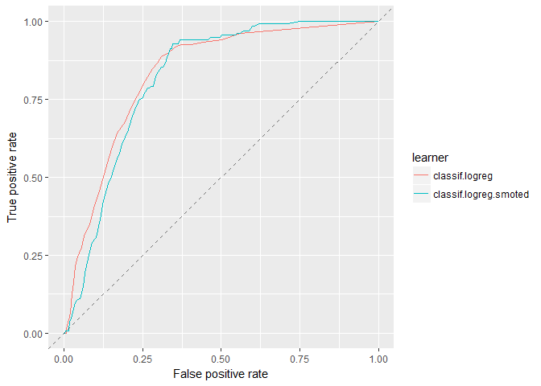

Looking at the ROC curves, we see that they intersect but otherwise have similar performance. It is important to note, in practice, we choose a threshold to operate a model. Therefore, the model with a larger area may not be the model with better performance within a limited threshold range.

#### Precision-Recall Curves

``` r
plotROCCurves(logreg_df_4wk, measures = list(tpr, ppv), diagonal = FALSE)
```

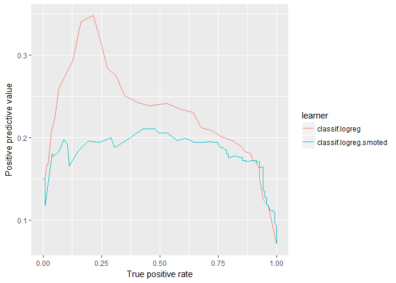

Here, if you are considering AUC-PR, the vanilla logistic regression does better than the SMOTEd model. Another thing to note is that the positive predictive value (precision) is fairly low for both models. Even though the AUC looked decent at 0.83 there is still a lot of imprecision in these models. Otherwise, the SMOTE model generally does better when recall (TPR) is high and vice verse for the vanilla model.

#### Threshold Plots

``` r
plotThreshVsPerf(logreg_df_4wk,  measures = list(fpr, fnr))
```

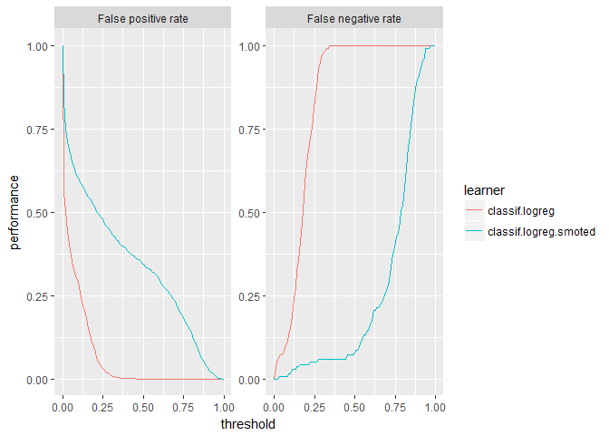

Threshold plots are common visualizations that help determine an appropriate threshold on which to operate. The FPR and FNR clearly illustrate the opposing tradeoff of each model. However it is difficult to compare these models using FPR and FNR since the imbalanced nature of the data has effectively squished the vanilla logistic model to the far left: slope is zero when the threshold is greater than ≈ 0.4.

``` r
plotThreshVsPerf(logreg_df_4wk,  measures = list(f1, bac))
```

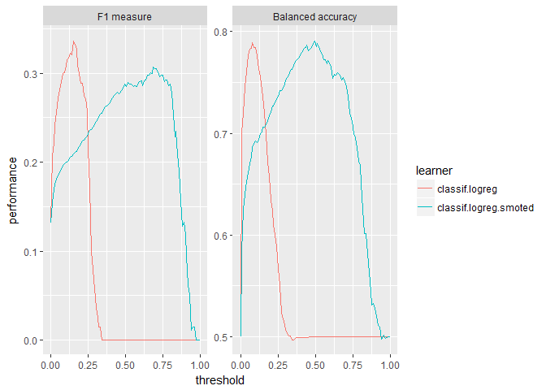

For our use case, threshold plots for F1 score and balanced accuracy make it easier to identify good thresholds. And while the vanilla logistic regression is still squished to the left, we can compare the performance peaks for the models. For F1, the vanilla model tends to have a higher peak. Whereas for balanced accuracy, SMOTE tends to have a slightly higher peak. Notice that the balanced accuracy for the SMOTEd model centers around the default threshold of 0.5 whereas the F1 score does not.

### Confusion Matrices

To calculate the confusion matrices, we'll train a new model using the full training set and predict against the holdout. Before, we only used the training data and aggregated the performance of the 20 cross-validated folds. We separate the data this way to prevent biasing our operating thresholds for these models.

The training set and holdout are defined at the beginning of this notebook and do not change. However, after tuning the SMOTE parameters, we rerun the cross-validation which may result in changes to the SMOTE model and operating thresholds for both models.

#### Vanilla Logistic Regression (default threshold)

            predicted
    true     Left Stayed -err.-
      Left      0     67     67
      Stayed    0    884      0
      -err.-    0     67     67

          acc       bac       auc        f1 
    0.9295478 0.5000000 0.8041298 0.0000000 

If you just look at accuracy (93%), this model performs great! But it is useless for the business. This model predicted that 0 employees would leave in the next 4 weeks but actually 67 left. This is why we need balanced performance measures like balanced accuracy for imbalanced classification problems. The balanced accuracy of 50% clearly illustrates the problem of this model.

#### SMOTE Logistic Regression (default threshold)

            predicted
    true     Left Stayed -err.-
      Left     56     11     11
      Stayed  277    607    277
      -err.-  277     11    288

          acc       bac       auc        f1 
    0.6971609 0.7612362 0.8177382 0.2800000 

This is the first evidence that SMOTE works. We have a more balanced model (76.1% balanced accuracy compared to 50%) that might actually be useful for the business. It narrows the pool of employees at risk of attrition from 951 down to 333 while capturing 83.6% of employees that actually left. If this were the only information available, then SMOTE does appear to result in a better model.

However the AUC is similar for both models indicating similar performance. As mentioned earlier, we can operate these models at different thresholds.

#### Tuning the Operating Threshold

The following code tunes the operating threshold for each model:

``` r
metric <- f1
logreg_thresh_vanilla <- tuneThreshold(
                             getBMRPredictions(logreg_bchmk 
                                  ,learner.ids ="classif.logreg"
                                  ,drop = TRUE) 
                             ,measure = metric)
logreg_thresh_SMOTE <- tuneThreshold(
                             getBMRPredictions(logreg_bchmk 
                                  ,learner.ids ="classif.logreg.smoted"
                                  ,drop = TRUE) 
                             ,measure = metric)
```

Here we've tuned these models using the F1 measure but we could have easily used a different metric.

#### Vanilla Logistic Regression (tuned threshold)

            predicted
    true     Left Stayed -err.-
      Left     29     38     38
      Stayed  130    754    130
      -err.-  130     38    168

          acc       bac       auc        f1 
    0.8233438 0.6428885 0.8041298 0.2566372 

#### SMOTE Logistic Regression (tuned threshold)

            predicted
    true     Left Stayed -err.-
      Left     39     28     28
      Stayed  164    720    164
      -err.-  164     28    192

          acc       bac       auc        f1 
    0.7981073 0.6982846 0.8177382 0.2888889 

Setting the tuned operating threshold results in two very similar models! Depending on the run, there might be a slight benefit to the SMOTEd model, but not enough to say with confidence.

But perhaps SMOTE just needs some tuning.

#### Tuning SMOTE

The SMOTE algorithm is defined by the parameters *rate* and *nearest neighbors*. *Rate* defines how much to oversample the minority class. *Nearest neighbors* defines how many nearest neighbors to consider. Tuning these should result in better model performance.

``` r
logreg_ps = makeParamSet(
              makeIntegerParam("sw.rate", lower = 8L, upper = 28L)
              ,makeIntegerParam("sw.nn", lower = 2L, upper = 8L)
              )
ctrl = makeTuneControlIrace(maxExperiments = 400L)
logreg_tr = tuneParams(logreg_lrns[[2]], tsk_train_4wk, rdesc, list(f1, bac), logreg_ps, ctrl)
logreg_lrns[[2]] = setHyperPars(logreg_lrns[[2]], par.vals=logreg_tr$x)

# Fit the model
logreg_bchmk = benchmark(logreg_lrns, 
                  tsk_train_4wk, 
                  rdesc, show.info = FALSE, 
                  measures = list(acc, bac, auc, f1))
logreg_thresh_vanilla <- tuneThreshold(
                                  getBMRPredictions(logreg_bchmk 
                                                    ,learner.ids ="classif.logreg"
                                                    ,drop = TRUE), 
                                  measure = metric)
logreg_thresh_SMOTE <- tuneThreshold(
                                  getBMRPredictions(logreg_bchmk 
                                                    ,learner.ids ="classif.logreg.smoted"
                                                    ,drop = TRUE), 
                                  measure = metric)
```

#### Vanilla Logistic Regression (tuned threshold)

            predicted
    true     Left Stayed -err.-
      Left     35     32     32
      Stayed  145    739    145
      -err.-  145     32    177

          acc       bac       auc        f1 
    0.8138801 0.6791805 0.8041298 0.2834008 

#### SMOTE Logistic Regression (tuned threshold and SMOTE)

            predicted
    true     Left Stayed -err.-
      Left     42     25     25
      Stayed  182    702    182
      -err.-  182     25    207

          acc       bac       auc        f1 
    0.7823344 0.7104917 0.8105795 0.2886598 

If we account for resampling variance, the tuned SMOTE makes little difference. Perhaps the initial SMOTE parameters close enough to the optimal settings. This table shows how they changed:

|         | Rate | Nearest Neighbors |
|--------:|:----:|:-----------------:|
|  Initial|  18  |         5         |
|    Tuned|   9  |         2         |

The rate decreased by 9 and the number of nearest neighbors decreased by 3.

After running this code multiple times, SMOTE generally produces models with higher balanced accuracy but lower accuracy. In terms of AUC and F1, it is harder to tell. Either way, even if SMOTE is tuned, observed performance increases are small compared to a vanilla logistic model with a tuned operating threshold. These results may also depend on the data itself. A different dataset intended to solve another imbalanced classification problem may have different results using SMOTE with logistic regression.

Benchmarking Decision Tree
--------------------------

``` r
# Fit the model
rpart_bchmk = benchmark(rpart_lrns, 
                  tsk_train_4wk, 
                  rdesc, show.info = FALSE, 
                  measures = list(acc, bac, auc, f1))
rpart_bchmk_perf <- getBMRAggrPerformances(rpart_bchmk, as.df = TRUE)
rpart_bchmk_perf %>% select(-task.id) %>% knitr::kable()
```

| learner.id           |  acc.test.mean|  bac.test.mean|  auc.test.mean|  f1.test.mean|
|:---------------------|--------------:|--------------:|--------------:|-------------:|
| classif.rpart        |      0.9290539|      0.5888060|      0.6995163|     0.2594619|
| classif.rpart.smoted |      0.7491146|      0.7771476|      0.8605376|     0.3113137|

Let's be honest, the SMOTEd logistic regression was lackluster. But for the decision tree model, SMOTE increases AUC by 0.16. Both flavors have similar F1 scores; otherwise we see the same tradeoff between accuracy and balanced accuracy as in the logistic regression.

``` r
# Visualize results
rpart_df_4wk = generateThreshVsPerfData(rpart_bchmk, 
            measures = list(fpr, tpr, mmce, bac, ppv, tnr, fnr, f1))
```

#### ROC Curves

``` r
plotROCCurves(rpart_df_4wk)
```

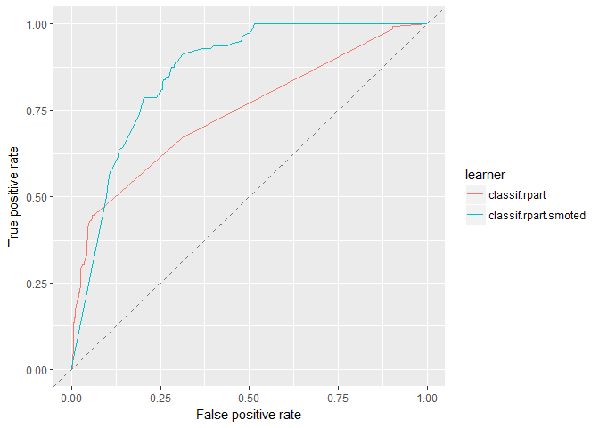

It's easy to see that SMOTE has a higher AUC than the vanilla model, but since the lines cross, each perform better within certain operating thresholds.

#### Precision-Recall Curves

``` r
plotROCCurves(rpart_df_4wk, measures = list(tpr, ppv), diagonal = FALSE)
```

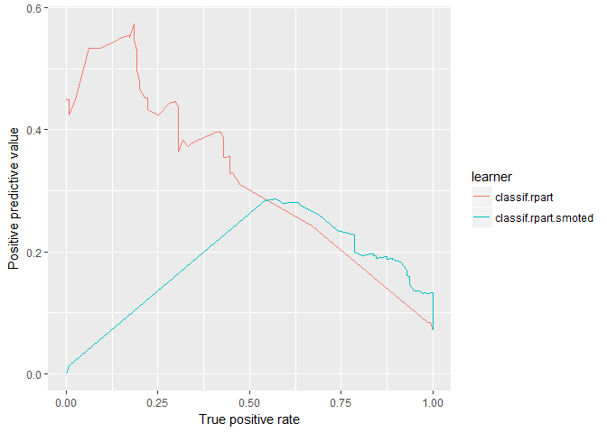

The vanilla model scores much higher on precision (PPV) but declines much more quickly as recall increases. SMOTE is more precise when recall (TPR) is greater than ≈ 0.75. Additionally, notice the straight lines, likely, there are no data in these regions making each model only viable for half the PR Curve.

#### Threshold Plots

``` r
plotThreshVsPerf(rpart_df_4wk,  measures = list(fpr, fnr))
```

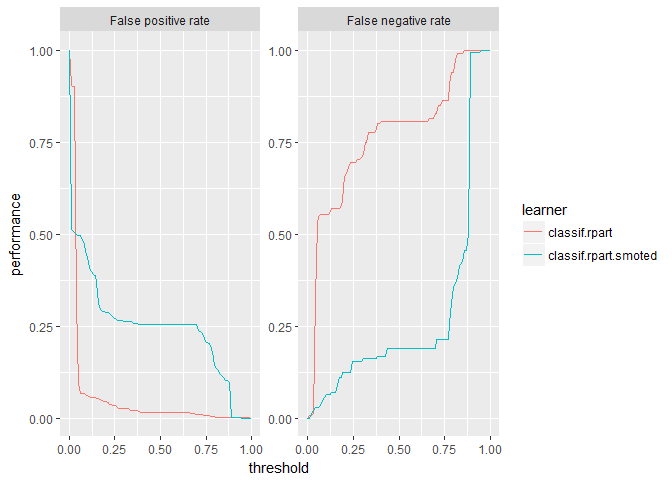

The nearly vertical slopes of these threshold plots represent the straight lines on the PR Curve plot.

``` r
plotThreshVsPerf(rpart_df_4wk,  measures = list(f1, bac))
```

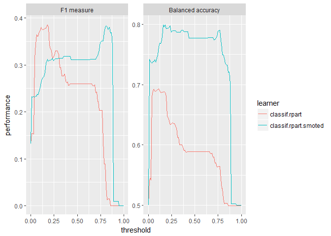

If we're concerned primarily with balanced accuracy, SMOTE is clearly better at all thresholds. For the F1 score however, it depends on the operating threshold of the model. Notice balanced accuracy is once again centered around the default threshold of 0.5 and the F1 measure is not. The F1 performance to threshold pattern is roughly opposite for the two flavors of decision trees.

### Confusion Matrices

#### Vanilla Decision Tree (default threshold)

            predicted
    true     Left Stayed -err.-
      Left     10     57     57
      Stayed    7    877      7
      -err.-    7     57     64

          acc       bac       auc        f1 
    0.9327024 0.5706676 0.7061694 0.2380952 

Using the default threshold, the vanilla decision tree manages to identify some employee attrition. In face, its accuracy of 93.3% is higher than the baseline case of always predicting the majority class (93%). It is relatively precise (0.59) but has low recall (0.15). Overall accuracy is high (93.3%), but the model is not very balanced (57.1%).

#### SMOTE Decision Tree (default threshold)

            predicted
    true     Left Stayed -err.-
      Left     55     12     12
      Stayed  232    652    232
      -err.-  232     12    244

          acc       bac       auc        f1 
    0.7434280 0.7792260 0.8338117 0.3107345 

The SMOTE Decision Tree does a much better job of capturing employees that left (82% compared to 15%) but at the cost of precision. The model identifies 287 when only 55 from that group actually leave. Still this model is more useful to the business than the vanilla decision tree at the default threshold.

#### Tuning the Operating Threshold

``` r
rpart_thresh_vanilla <- tuneThreshold(
                                  getBMRPredictions(rpart_bchmk 
                                                    ,learner.ids ="classif.rpart"
                                                    ,drop = TRUE), 
                                  measure = metric)
rpart_thresh_SMOTE <- tuneThreshold(
                                  getBMRPredictions(rpart_bchmk 
                                                    ,learner.ids ="classif.rpart.smoted"
                                                    ,drop = TRUE), 
                                  measure = metric)
```

As before, we'll be using the F1 measure.

#### Vanilla Decision Tree (tuned threshold)

            predicted
    true     Left Stayed -err.-
      Left     22     45     45
      Stayed   26    858     26
      -err.-   26     45     71

          acc       bac       auc        f1 
    0.9253417 0.6494732 0.7061694 0.3826087 

Once we tune the threshold, the vanilla decision tree model performs much better--identifying more employees that leave with relatively high precision. The F1 score increases from 0.238 to 0.383.

#### SMOTE Decision Tree (tuned threshold)

            predicted
    true     Left Stayed -err.-
      Left     32     35     35
      Stayed   80    804     80
      -err.-   80     35    115

          acc       bac       auc        f1 
    0.8790747 0.6935571 0.8338117 0.3575419 

Changing the operating threshold for the SMOTEd decision tree results in a 13.6% higher accuracy, 8.57% lower balanced accuracy, and higher F1 measure of 4.68%.

These changes to the operating threshold result in a similar F1 performance for both flavors of decision tree (0.358 compared to 0.383).

#### Tuning SMOTE

``` r
rpart_ps = makeParamSet(
              makeIntegerParam("sw.rate", lower = 8L, upper = 28L)
              ,makeIntegerParam("sw.nn", lower = 2L, upper = 8L)
              )
ctrl = makeTuneControlIrace(maxExperiments = 200L)
rpart_tr = tuneParams(rpart_lrns[[2]], tsk_train_4wk, rdesc, list(f1, bac), rpart_ps, ctrl)
rpart_lrns[[2]] = setHyperPars(rpart_lrns[[2]], par.vals=rpart_tr$x)
```

``` r
# Fit the model
rpart_bchmk = benchmark(rpart_lrns, 
                  tsk_train_4wk, 
                  rdesc, show.info = FALSE, 
                  measures = list(acc, bac, auc, f1))
rpart_thresh_vanilla <- tuneThreshold(
                                  getBMRPredictions(rpart_bchmk 
                                                    ,learner.ids ="classif.rpart"
                                                    ,drop = TRUE), 
                                  measure = metric)
rpart_thresh_SMOTE <- tuneThreshold(
                                  getBMRPredictions(rpart_bchmk 
                                                    ,learner.ids ="classif.rpart.smoted"
                                                    ,drop = TRUE), 
                                  measure = metric)
```

#### Vanilla Decision Tree (tuned threshold)

            predicted
    true     Left Stayed -err.-
      Left     23     44     44
      Stayed   35    849     35
      -err.-   35     44     79

          acc       bac       auc        f1 
    0.9169295 0.6518454 0.7061694 0.3680000 

#### SMOTE Decision Tree (tuned threshold and SMOTE)

            predicted
    true     Left Stayed -err.-
      Left     32     35     35
      Stayed   80    804     80
      -err.-   80     35    115

          acc       bac       auc        f1 
    0.8790747 0.6935571 0.7885628 0.3575419 

Tuning SMOTE for the decision tree changed the accuracy from 87.9% to 87.9% and the balanced accuracy from 69.4% to 69.4%. The following table shows how the rate and number of nearest neighbors changed:

|         | Rate | Nearest Neighbors |
|--------:|:----:|:-----------------:|
|  Initial|  18  |         5         |
|    Tuned|  15  |         7         |

The rate decreased by 3 and the number of nearest neighbors increased by 2.

Given our data, SMOTE for decision trees seems to offer real performance increases to the model. That said, the performance increases are largely via tradeoff between accuracy and balanced accuracy. Setting the operating threshold for the vanilla model results in a similarly performant model. However, we need to consider that identifying rare events is our primary concern. SMOTE allows us to operate with increased performance when high recall is important.

Benchmarking randomForest
-------------------------

``` r
# Fit the model
randomForest_bchmk = benchmark(randomForest_lrns, 
                  tsk_train_4wk, 
                  rdesc, show.info = FALSE, 
                  measures = list(acc, bac, auc, f1))
randomForest_bchmk_perf <- getBMRAggrPerformances(randomForest_bchmk, as.df = TRUE)
randomForest_bchmk_perf %>% select(-task.id) %>% knitr::kable()
```

| learner.id                  |  acc.test.mean|  bac.test.mean|  auc.test.mean|  f1.test.mean|
|:----------------------------|--------------:|--------------:|--------------:|-------------:|
| classif.randomForest        |      0.9310609|      0.5878136|      0.8942103|     0.2674242|
| classif.randomForest.smoted |      0.8868540|      0.7553178|      0.8875052|     0.4339340|

For the randomForest models, we see similar patters as for the logistic regression and decision tress. There is a trade off between accuracy and balanced accuracy. Unlike the decision tree models, SMOTE does not improve AUC for SMOTE randomForest (both are ≈ 0.89).

``` r
# Visualize results
randomForest_df_4wk = generateThreshVsPerfData(randomForest_bchmk, 
            measures = list(fpr, tpr, mmce, bac, ppv, tnr, fnr, f1))
```

#### ROC Curves

``` r
plotROCCurves(randomForest_df_4wk)
```

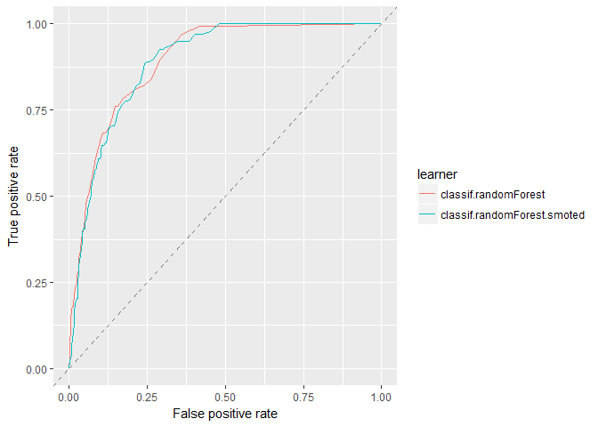

Both models cross multiple times showing either model is likely good for most thresholds.

#### Precision-Recall Curves

``` r
plotROCCurves(randomForest_df_4wk, measures = list(tpr, ppv), diagonal = FALSE)
```


This PR-Curve shows more distinctly that SMOTE generally performs better when recall is high, whereas the vanilla model generally performs better when recall is lower.

#### Threshold Plots

``` r
plotThreshVsPerf(randomForest_df_4wk,  measures = list(fpr, fnr))
```

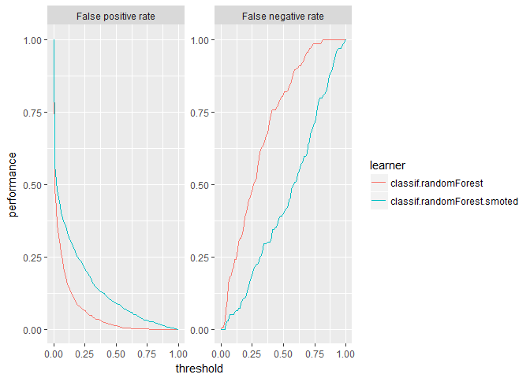

``` r
plotThreshVsPerf(randomForest_df_4wk,  measures = list(f1, bac))
```

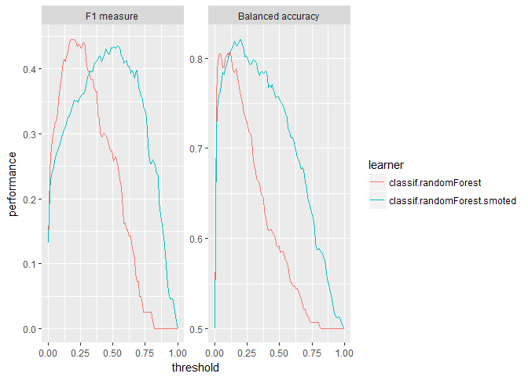

Interestingly, the SMOTE randomForest does not center balanced accuracy around the default threshold; rather F1 is centered on the 0.5 threshold. Otherwise we see that SMOTE produces a higher peak for balanced accuracy but lower for F1. Additionally, the vanilla model is still squished to the left due to its class imbalance.

### Confusion Matrices

#### Vanilla randomForest (default threshold)

            predicted
    true     Left Stayed -err.-
      Left     15     52     52
      Stayed    7    877      7
      -err.-    7     52     59

          acc       bac       auc        f1 
    0.9379600 0.6079810 0.8559718 0.3370787 

As far as vanilla models go, and given the default threshold, the randomForest performs the best. That said, this model captures very few employees that leave.

#### SMOTE randomForest (default threshold)

            predicted
    true     Left Stayed -err.-
      Left     34     33     33
      Stayed   78    806     78
      -err.-   78     33    111

          acc       bac       auc        f1 
    0.8832808 0.7096137 0.8686263 0.3798883 

The SMOTEd randomForest also does well. The accuracy is high and manages a good balanced accuracy.

#### Tuning the Operating Threshold

``` r
randomForest_thresh_vanilla <- tuneThreshold(
                                  getBMRPredictions(randomForest_bchmk 
                                                    ,learner.ids ="classif.randomForest"
                                                    ,drop = TRUE), 
                                  measure = metric)
randomForest_thresh_SMOTE <- tuneThreshold(
                                  getBMRPredictions(randomForest_bchmk 
                                                    ,learner.ids ="classif.randomForest.smoted"
                                                    ,drop = TRUE), 
                                  measure = metric)
```

As before, we'll be using the F1 measure.

#### Vanilla randomForest (tuned threshold)

            predicted
    true     Left Stayed -err.-
      Left     38     29     29
      Stayed   78    806     78
      -err.-   78     29    107

          acc       bac       auc        f1 
    0.8874869 0.7394644 0.8559718 0.4153005 

#### SMOTE randomForest (tuned threshold)

            predicted
    true     Left Stayed -err.-
      Left     36     31     31
      Stayed   81    803     81
      -err.-   81     31    112

          acc       bac       auc        f1 
    0.8822292 0.7228422 0.8686263 0.3913043 

At the tuned threshold, the performance of both flavors perform better and are once again very similar. Depending on the run, SMOTE will have a higher balanced accuracy, but otherwise there is little difference between the models.

#### Tuning SMOTE

``` r
randomForest_ps = makeParamSet(
              makeIntegerParam("sw.rate", lower = 8L, upper = 28L)
              ,makeIntegerParam("sw.nn", lower = 2L, upper = 8L)
              )
ctrl = makeTuneControlIrace(maxExperiments = 200L)
randomForest_tr = tuneParams(randomForest_lrns[[2]], tsk_train_4wk, rdesc, list(f1, bac), randomForest_ps, ctrl)
randomForest_lrns[[2]] = setHyperPars(randomForest_lrns[[2]], par.vals=randomForest_tr$x)
```

``` r
# Fit the model
randomForest_bchmk = benchmark(randomForest_lrns, 
                  tsk_train_4wk, 
                  rdesc, show.info = FALSE, 
                  measures = list(acc, bac, auc, f1))
randomForest_thresh_vanilla <- tuneThreshold(
                                  getBMRPredictions(randomForest_bchmk 
                                                    ,learner.ids ="classif.randomForest"
                                                    ,drop = TRUE), 
                                  measure = metric)
randomForest_thresh_SMOTE <- tuneThreshold(
                                  getBMRPredictions(randomForest_bchmk 
                                                    ,learner.ids ="classif.randomForest.smoted"
                                                    ,drop = TRUE), 
                                  measure = metric)
```

#### Vanilla randomForest (tuned threshold)

            predicted
    true     Left Stayed -err.-
      Left     40     27     27
      Stayed  101    783    101
      -err.-  101     27    128

          acc       bac       auc        f1 
    0.8654048 0.7413808 0.8527470 0.3846154 

#### SMOTE randomForest (tuned threshold and SMOTE)

            predicted
    true     Left Stayed -err.-
      Left     37     30     30
      Stayed   98    786     98
      -err.-   98     30    128

          acc       bac       auc        f1 
    0.8654048 0.7206895 0.8637384 0.3663366 

Given this data, tuning SMOTE does not seem to improve performance. The following table shows how the parameters for SMOTE changed during the tuning process:

|         | Rate | Nearest Neighbors |
|--------:|:----:|:-----------------:|
|  Initial|  18  |         5         |
|    Tuned|  18  |         3         |

The rate did not change and the number of nearest neighbors decreased by 2.

Given this data for randomForest, SMOTE does little to improve model performance. At optimized operating thresholds, both flavors end up with very similar accuracy and balanced accuracy. There does appear to be some benefit using SMOTE where recall is high and precision is low, however the business may not want to throw such a large net in order to capture all of the employees that leave. Practically speaking, SMOTE did not improve the performance for this problem when using randomForest.

``` r
parallelStop() 
```

    Stopped parallelization. All cleaned up.

Conclusion
----------

Given this data, SMOTE improved AUC of the decision tree model but offered little improvement for logistic regression or randomForest. Otherwise, SMOTE offered a way to trade accuracy for balanced accuracy. For our problem of employee attrition, this trade off is worth it to continue using SMOTE. Even when operating thresholds are optimized, there is--at worst--no change in the performance of the models. That said, the ideal solution might be an ensemble of SMOTE and vanilla models at operating thresholds suited for their flavor.

This notebook shows SMOTE impacts models differently, a finding supported by [Experimental Perspectives on Learning from Imbalanced Data](http://citeseerx.ist.psu.edu/viewdoc/download?doi=10.1.1.79.4356&rep=rep1&type=pdf). They also found, while generally beneficial, SMOTE often did not perform as well as simple random undersampling--something we might try in a future notebook. A different paper, [SMOTE for high-dimensional class-imbalanced data](https://bmcbioinformatics.biomedcentral.com/articles/10.1186/1471-2105-14-106), found that for high-dimensional data, SMOTE is beneficial but only after variable selection is performed. The employee attrition problem featured here does not have high-dimensional data, however it is useful to consider how feature selection may impact the calculated Euclidean distance used in the SMOTE algorithm. If we gather more features, it may be beneficial to perform more rigorous feature selection before SMOTE to improve model performance.
